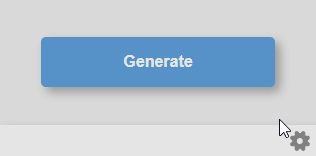

# Password Generator Chrome Extension

A lightweight and user-friendly Chrome extension that generates strong and secure passwords with just one click. Perfect for securing your online accounts.

[**Download the latest version here**](https://chromewebstore.google.com/detail/password-generator/ehgbipfnhjjobfkklifaiabkbhjghofe?authuser=0&hl=fr)


## Features

- **One-click password generation**: Instantly create strong passwords without any hassle.
- **Password copy to clipboard**: One click to copy the generated password to your clipboard.
- **Sleek design**: Smooth animations and transitions for a polished user experience.
- **Settings**: Password length and character type options via settings page
- **No complex setup**: Just install and start using!

---

<br>
<br>

<p align="center">
  
</p>

<br>

---

## 🛠 Development Setup

To run this extension locally during development:

1. Clone this repository:
   ```
   git clone https://github.com/cfrBernard/Password-Generator-Chrome.git
   ```

2. Open Chrome and navigate to 
   ```
   chrome://extensions/
   ```

3. Enable Developer mode.
4. Click on Load unpacked and select the extension directory.

---

## Notes:

- For more information about the version, please refer to the [changelog](docs/CHANGELOG.md) section.
- This project is licensed under the MIT License. See the [LICENSE](LICENSE.md) file for details.

---

## Contact
For issues, suggestions, or contributions, feel free to open an issue on the GitHub repository.
